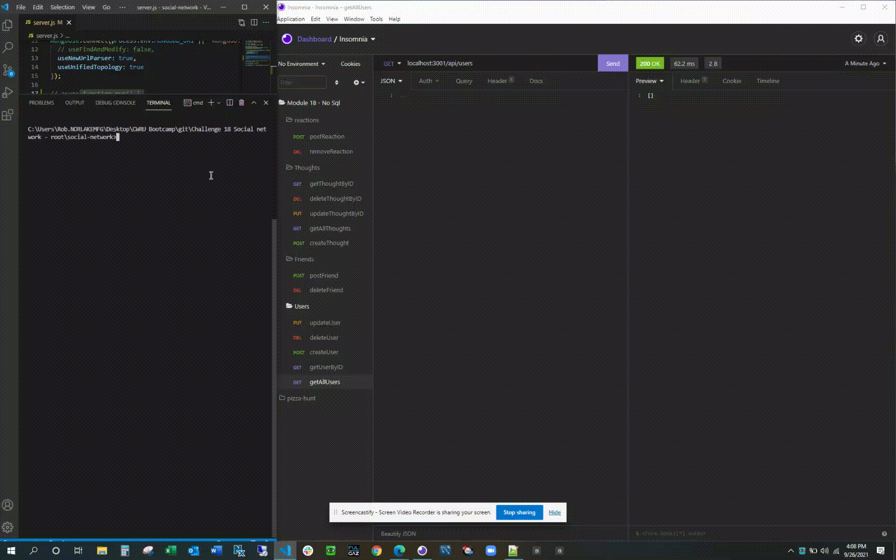

# 18 NoSQL: Social Network API

## Author: Rob Ellingson
Source: [Github](https://github.com/awolrob/social-network)

```md
AS A social media startup
I WANT an API for my social network that uses a NoSQL database
SO THAT my website can handle large amounts of unstructured data
```


## Acceptance Criteria

```md
GIVEN a social network API
WHEN I enter the command to invoke the application
THEN my server is started and the Mongoose models are synced to the MongoDB database
WHEN I open API GET routes in Insomnia Core for users and thoughts
THEN the data for each of these routes is displayed in a formatted JSON
WHEN I test API POST, PUT, and DELETE routes in Insomnia Core
THEN I am able to successfully create, update, and delete users and thoughts in my database
WHEN I test API POST and DELETE routes in Insomnia Core
THEN I am able to successfully create and delete reactions to thoughts and add and remove friends to a user’s friend list
```

## Install
```
npm init -y
npm install express
npm install mongoose
```

## Run
```
npm start
```

## Walkthrough videos

The following images were generated using the application:

- - -
* How to start the application’s server

- - -
* Example GET routes for all users and all thoughts using Insomnia Core.

- - -
* Example GET routes for a single user and a single thought using Insomnia Core.

- - -
* Example POST, PUT, and DELETE routes for users and thoughts using Insomnia Core.

- - -
* Example POST and DELETE routes for a user’s friend list using Insomnia Core.

- - -
* Example POST and DELETE routes for reactions to thoughts using Insomnia Core.


* Bonus: +10 Points - Example deleting a user's associated thoughts when the user is deleted.


## Walkthrough video


## Shared Walkthrough video
https://drive.google.com/file/d/1qQreup64zlB8_TlER7MOUd3tHe24UQHK/view?usp=sharing

- - -
` https://github.com/awolrob | 2021-09-26 ` 